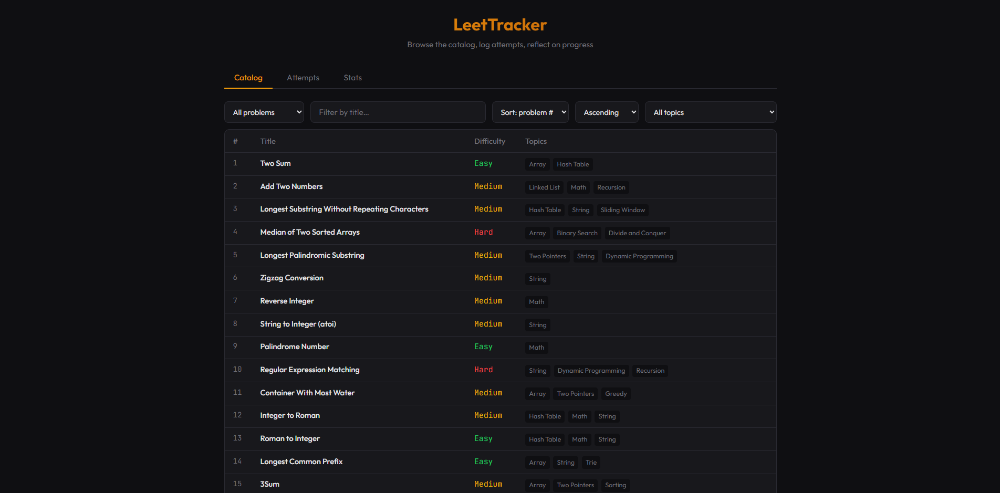
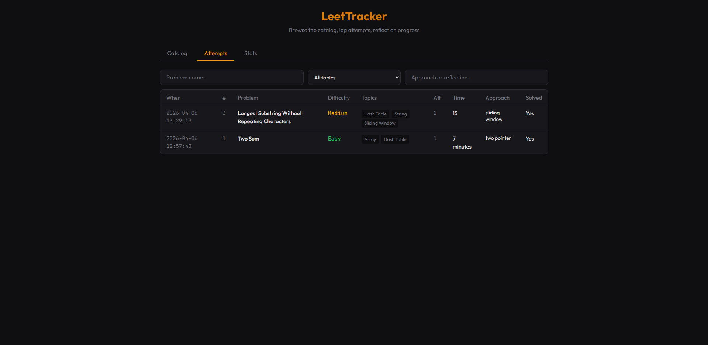
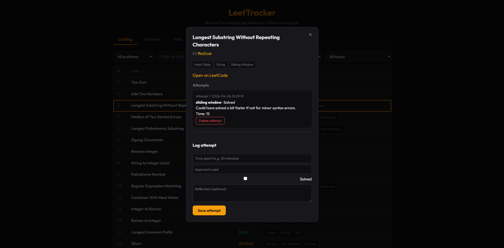
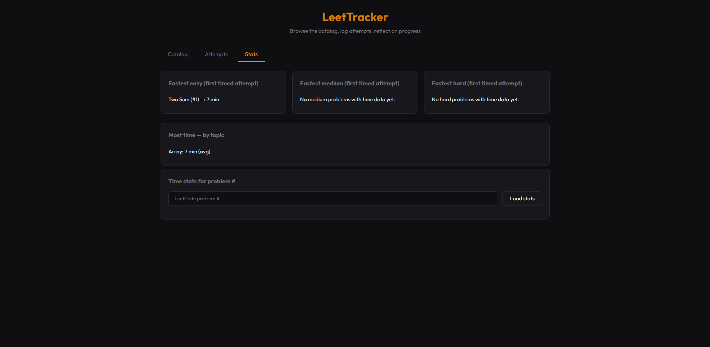

# LeetTracker

Web app for tracking LeetCode practice: browse a catalog from a `leetcode.json` export, log attempts (time, approach, solved, notes), search past notes, and view simple stats. Optional **Blind 75** list and topic tags. There’s also a small **CLI** (`main.py`) for a manual problem list.

I built it to stay accountable while grinding problems and to practice Python, Flask, and plain HTML/CSS/JS.

## Features

- Catalog with sort, title filter, pagination; optional **Blind 75** (`data/blind75.json`)
- Per-problem attempts + optional **topic tags** (`data/problem_topics.json`)
- **Attempts** tab: all attempts with optional filters by problem name, topic, and approach/reflection; stats (fastest first attempt per difficulty, topic times, per-problem time)
- JSON **API** under `/api/…` (same app powers the UI)

## Stack

**Python · Flask · HTML/CSS/JavaScript** — no framework on the front end. Data lives in **JSON files** (`data/attempts.json`, etc.), not a database.

## Run locally

```bash
pip install -r requirements.txt
```

Put **`leetcode.json`** at the repo root (LeetCode `stat_status_pairs` export). Then:

```bash
python app.py
```

Open http://127.0.0.1:5000 · CLI: `python main.py`

## Project layout

```
app.py              # Flask + routes
main.py             # CLI
templates/          # index.html
static/             # app.js, style.css
utils/              # catalog, storage, time parsing
problems/           # optional: per-problem JSON dumps (topics, description, …)
data/               # attempts.json, blind75.json, problem_topics.json, …
leetcode.json       # catalog export (root)
```

**Topic tags:** If you have a `problems/` folder of LeetCode JSON files, regenerate `data/problem_topics.json` (skips SQL-only and Shell-only problems):

`python scripts/build_problem_topics_from_problems.py`

## Deploy (e.g. Railway)

Use a production server, not `python app.py`:

```bash
gunicorn app:app --bind 0.0.0.0:$PORT
```

Mount **persistent storage** on `data/` if you want `attempts.json` to survive redeploys. There is **no login** yet—a public URL shares one `attempts.json` for everyone unless you add auth.

## Screenshots

| Catalog | Attempts |
| --- | --- |
|  |  |

| Problem / attempt log | Stats |
| --- | --- |
|  |  |

## Ideas

Auth + per-user data, charts, CSV export, LeetCode import helper, tests.

## Author

**Nvafeomo K. Konneh**

## License

MIT
